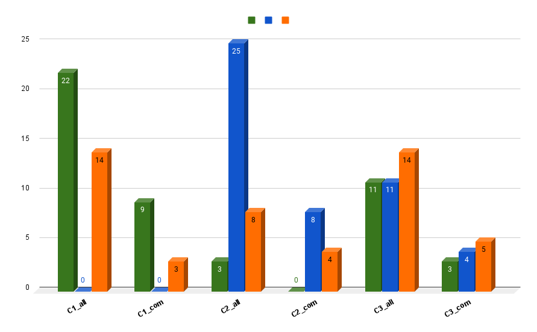

# Jakarta EE Platform Call

Date: 2021-06-22

Present:

- Jan Westerkamp (iJUG)
- Jesse McConnell (Webtide)
- Kevin Sutter (IBM)
- Ivar Grimstad (Eclipse Foundation)
- Dmitry Kornilov (Oracle)
- Wrener Keil (Individual, Ambassador)
- Jean-Louis Monteiro (Tomitribe)
- Emily Jiang (IBM)
- Steve Millidge (Payara)
- BJ Hargrave (IBM)
- Thomas Watson (IBM)
- Cesar Hernández (Tomitribe)
- John Clingan (Red Hat)
- Ryan Cuprak (Jakarta EE Ambassadors)
- Scott Marlow (Red Hat)
- Paul Nicolucci (IBM)
- Roberto Cortez (Red Hat)
- Martin Stefanko (Red Hat)
- Lukas Jungmann (Oracle)
- Scott Kurz (IBM)
- Kenji Kazumura (Fujitsu)

## Agenda and Minutes

### [Ed Bratt] -- If a component spec. decides to adopt Java 11 (or higher) as runtime base (or utilize language features), does that require the component Spec. to declare a Major release increment?

* Semantically a minor change? 
* Upgrading an app to the new API will require compiling with Java 11
* Moving an app compiled with Java SE 8 against the Jakarta EE 9.1 APIs to a new runtime should run
* If a Jakarta EE 9 compiled binary can run on a Jakarta EE 10 runtime, there are not breaking changes?
* If you want to use any of the new APIs, your app will need to be recompiled with the new Java SE level supported (e.g. Java SE 11).
* Should a spec doing a minor update compile to 8, or 11? If it does not use any 11 features?
  * All updated specs (minor and major) must compile with the version selected for Jakarta EE 10
  * We will need to configure the platform api builds to be able to pull in component API deps built with previous SE versions without rebuilding them
* **Action:**  Determine whether we need a service or minor release for *every* component spec due to the Java 11 (or 17 or whatever) update.
* **CONCLUSION: As long as existing binaries still work, it’s just a minor update. Binary compatibility is preserved.**

### Java SE level

* https://docs.google.com/spreadsheets/d/1Bu6IhGASVapXXaQix8HaED4JYx4UDj9eLEsjCP-7ddA/edit

* The preferred option is Option 1 - Java 11 as the base, minimum jdk for Jakarta EE 10. 
* We need to ensure that the TCK can run on 11 and 17 to give implementers the choice.
* We don’t want to set an upper limit for SE version, but have to have some process for handling unknowns as future SE versions come
